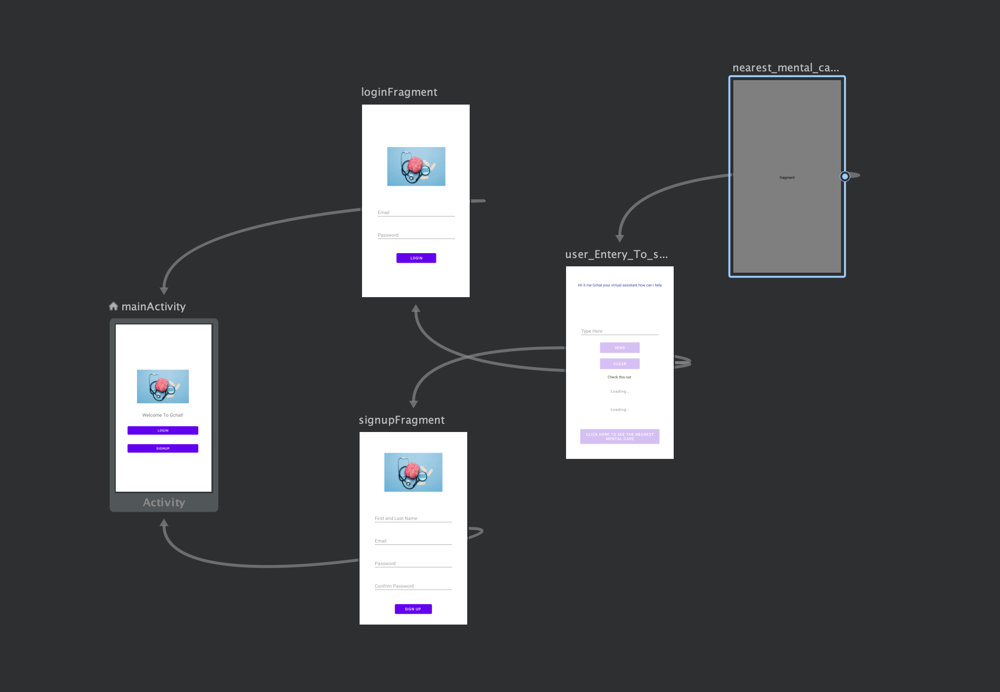

# SF Hacks 2 days Hackathon

A virtual assistant that is made by using firebase, ML Kit and Smart Reply. 

MVI

Source
https://developer.android.com/guide/navigation/navigation-getting-started
https://developers.google.com/ml-kit/language/smart-reply/android
https://developers.google.com/ml-kit/language/smart-reply/android
